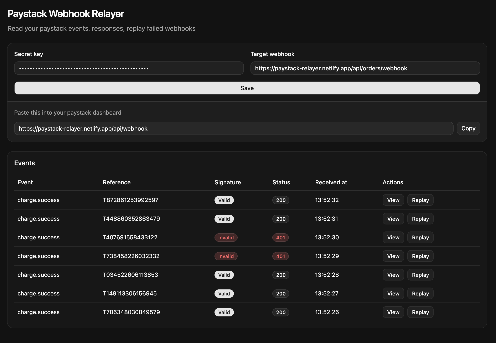
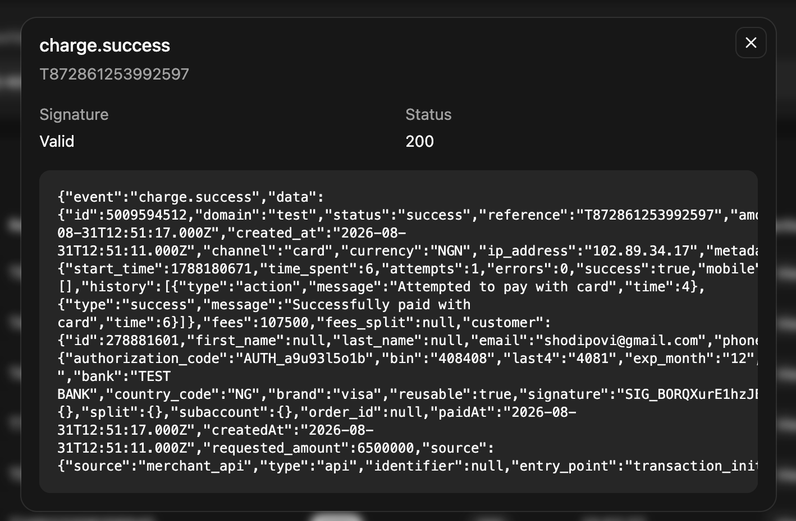
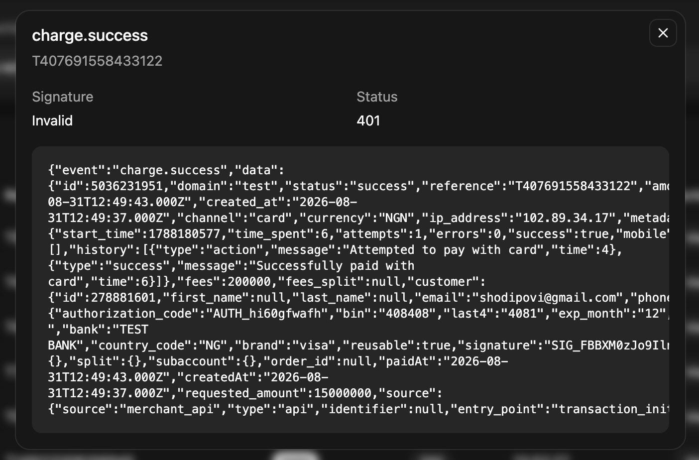

# Paystack Webhook Relayer

This demo verifies Paystack's incoming webhook signatures, forwards webhooks to your target endpoint, and lets you view and replay events

Use it here: [https://paystack-relayer.netlify.app

1. Run `npm install`
2. Run `npm run dev`
3. Enter your Paystack test secret key and your target webhook url
4. Copy the `/api/webhook` URL into your paystack dahsbord
5. Make an example payment
6. View the event and click `Replay` to send it again to the target url if need be

## What it looks like

Clicking `View` shows the bytes that was sent

|                                        |                                            |
| -------------------------------------- | ------------------------------------------ |
|  |  |

Settings and events are stored in Netlify Blobs. Locally it's memory.

> NOTE: This is strictly DEMO only, never use live keys here.

